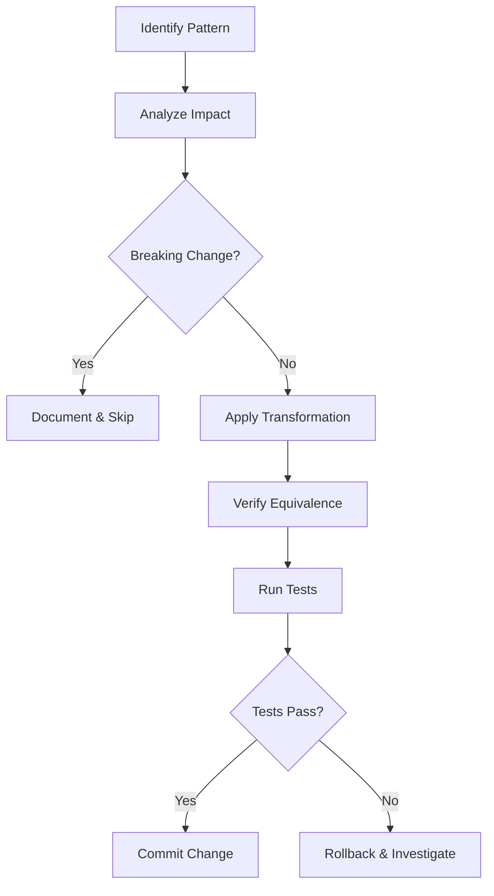

# Design Document: CodeWalker .NET 9 Optimization

## Overview

This design document outlines the approach for modernizing and optimizing the CodeWalker codebase to leverage .NET 9 features and improve code quality. The optimization effort targets specific patterns identified through codebase analysis, focusing on dictionary access, string handling, collection initialization, locking mechanisms, null handling, memory operations, LINQ usage, and async patterns.

The changes are designed to be incremental and non-breaking, maintaining full backward compatibility while improving performance and code readability.

## Architecture

The optimization work follows a pattern-based refactoring approach:



### Target Areas

1. **CodeWalker.Core** - Core library with game file parsing (highest priority)
2. **CodeWalker.WinForms** - Shared UI controls
3. **CodeWalker** - Main application

## Components and Interfaces

### Dictionary Pattern Optimizer

Transforms `ContainsKey` + indexer patterns to `TryGetValue`:

```csharp
// Before
if (dict.ContainsKey(key))
{
    var value = dict[key];
    // use value
}

// After
if (dict.TryGetValue(key, out var value))
{
    // use value
}
```

### String Formatter Modernizer

Converts `string.Format` to interpolated strings:

```csharp
// Before
string.Format("{0}: {1}", name, value)

// After
$"{name}: {value}"
```

### Collection Expression Converter

Updates collection initialization to use collection expressions:

```csharp
// Before
var list = new List<int> { 1, 2, 3 };
var array = new int[] { 1, 2, 3 };

// After
List<int> list = [1, 2, 3];
int[] array = [1, 2, 3];
```

### Lock Modernizer

Upgrades lock objects to `System.Threading.Lock`:

```csharp
// Before
private object syncRoot = new object();
lock (syncRoot) { /* ... */ }

// After
private Lock syncRoot = new();
lock (syncRoot) { /* ... */ }
```

### Null Pattern Modernizer

Applies null-conditional and null-coalescing operators:

```csharp
// Before
if (obj != null)
{
    obj.Method();
}

// After
obj?.Method();
```

### Memory Optimizer

Replaces loop-based array copying with efficient alternatives:

```csharp
// Before
for (int i = 0; i < source.Length; i++)
    dest[i] = source[i];

// After
source.AsSpan().CopyTo(dest);
// or
Array.Copy(source, dest, source.Length);
```

## Data Models

No new data models are introduced. The optimization work modifies existing code patterns without changing data structures or public APIs.

### Files to Modify

Based on codebase analysis, the following files contain optimization opportunities:

| File | Patterns Found |
|------|----------------|
| `CodeWalker.Core/GameFiles/GameFileCache.cs` | string.Format, new List<>, Task.Run |
| `CodeWalker.Core/World/Space.cs` | lock patterns, new List<>, Dictionary access |
| `CodeWalker.Core/Utils/FbxConverter.cs` | new List<>, array operations |
| `CodeWalker.WinForms/STNodeEditor/*.cs` | ContainsKey patterns, lock, Encoding.GetBytes |
| `CodeWalker/WorldForm.cs` | lock patterns, Monitor.TryEnter |
| `CodeWalker/PedsForm.cs` | lock patterns |
| `CodeWalker.Core/GameFiles/FileTypes/CacheDatFile.cs` | string.Format |
| `CodeWalker.Core/GameFiles/FileTypes/RelFile.cs` | string.Format |

## Correctness Properties

*A property is a characteristic or behavior that should hold true across all valid executions of a system-essentially, a formal statement about what the system should do. Properties serve as the bridge between human-readable specifications and machine-verifiable correctness guarantees.*

### Property 1: TryGetValue Equivalence
*For any* dictionary of type `Dictionary<K, V>` and any key `K`, using `TryGetValue(key, out value)` should return `true` and set `value` to the same result as `ContainsKey(key)` returning `true` followed by `dict[key]`, and should return `false` when `ContainsKey(key)` returns `false`.
**Validates: Requirements 1.1**

### Property 2: TryAdd Equivalence
*For any* dictionary and key-value pair, `TryAdd(key, value)` should produce the same dictionary state as checking `!ContainsKey(key)` then calling `Add(key, value)` when the key doesn't exist, and should leave the dictionary unchanged when the key exists.
**Validates: Requirements 1.3**

### Property 3: String Interpolation Equivalence
*For any* set of values used in `string.Format(format, args)`, the equivalent interpolated string should produce an identical output string.
**Validates: Requirements 2.1**

### Property 4: Collection Expression Equivalence
*For any* sequence of elements, a collection created using collection expression syntax `[e1, e2, ...]` should contain the same elements in the same order as `new List<T> { e1, e2, ... }` or `new T[] { e1, e2, ... }`.
**Validates: Requirements 3.1, 3.2**

### Property 5: Lock Mutual Exclusion Equivalence
*For any* concurrent access pattern to a shared resource, using `System.Threading.Lock` should provide the same mutual exclusion guarantees as `lock(object)`, ensuring no two threads execute the protected section simultaneously.
**Validates: Requirements 4.1**

### Property 6: Lock.TryEnter Equivalence
*For any* timeout value and lock state, `Lock.TryEnter(timeout)` should return the same acquisition result as `Monitor.TryEnter(obj, timeout)`.
**Validates: Requirements 4.3**

### Property 7: Null-Conditional Equivalence
*For any* nullable reference `obj` and member access `obj.Member`, using `obj?.Member` should return `null` when `obj` is `null` and return `obj.Member` when `obj` is not `null`, equivalent to `obj != null ? obj.Member : null`.
**Validates: Requirements 5.1**

### Property 8: Null-Coalescing Equivalence
*For any* nullable value `x` and fallback value `y`, `x ?? y` should return `x` when `x` is not `null` and return `y` when `x` is `null`, equivalent to `x != null ? x : y`.
**Validates: Requirements 5.2**

### Property 9: Pattern Matching Equivalence
*For any* object `obj` and type `T`, the pattern `obj is T typed` should bind `typed` to the same value as `(T)obj` when `obj is T` returns `true`, and should not execute the guarded block when `obj` is not of type `T`.
**Validates: Requirements 5.3**

### Property 10: Array Copy Equivalence
*For any* source array and destination array of compatible types, `source.AsSpan().CopyTo(dest)` or `Array.Copy(source, dest, length)` should produce a destination array with identical contents to element-by-element loop copying.
**Validates: Requirements 6.1**

### Property 11: Span Encoding Equivalence
*For any* string input, encoding using `Span<byte>` operations should produce the same byte sequence as `Encoding.UTF8.GetBytes(string)`.
**Validates: Requirements 6.3**

### Property 12: LINQ Consolidation Equivalence
*For any* input sequence, consolidated LINQ operations (e.g., `Where(p1).Where(p2)` → `Where(x => p1(x) && p2(x))`) should produce the same output sequence.
**Validates: Requirements 7.2**

### Property 13: Loop vs LINQ Equivalence
*For any* input sequence and transformation/filter operation, a loop-based implementation should produce the same output as the equivalent LINQ expression.
**Validates: Requirements 7.3**

### Property 14: Fire-and-Forget Exception Handling
*For any* fire-and-forget task that throws an exception, the exception should be caught and logged without crashing the application.
**Validates: Requirements 8.3**

## Error Handling

The optimization changes should not introduce new error conditions. Each transformation preserves the original error handling behavior:

1. **Dictionary Access**: `TryGetValue` returns `false` for missing keys (same as `ContainsKey`)
2. **String Operations**: Interpolation throws same exceptions as `string.Format` for null arguments
3. **Lock Operations**: `Lock` type throws same exceptions as `Monitor` for invalid operations
4. **Null Operations**: Null-conditional returns `null` instead of throwing `NullReferenceException`

## Testing Strategy

### Dual Testing Approach

The optimization work requires both unit tests and property-based tests to ensure correctness:

#### Unit Tests
- Verify specific transformation examples work correctly
- Test edge cases (empty collections, null values, concurrent access)
- Validate error conditions are preserved

#### Property-Based Tests

**Framework**: FsCheck (via FsCheck.Xunit) for .NET property-based testing

**Configuration**: Each property test runs minimum 100 iterations

**Test Annotations**: Each property-based test is tagged with:
```csharp
// **Feature: code-optimization-net9, Property {number}: {property_text}**
```

### Test Categories

1. **Dictionary Pattern Tests**
   - Property tests for TryGetValue equivalence
   - Property tests for TryAdd equivalence

2. **String Formatting Tests**
   - Property tests for interpolation equivalence with various types

3. **Collection Expression Tests**
   - Property tests for List and Array equivalence

4. **Lock Tests**
   - Property tests for mutual exclusion under concurrent access
   - Property tests for TryEnter timeout behavior

5. **Null Handling Tests**
   - Property tests for null-conditional operator
   - Property tests for null-coalescing operator
   - Property tests for pattern matching

6. **Memory Operation Tests**
   - Property tests for array copy equivalence
   - Property tests for Span encoding equivalence

7. **LINQ Tests**
   - Property tests for consolidation equivalence
   - Property tests for loop vs LINQ equivalence

### Test Project Structure

```
CodeWalker.Tests/
├── Properties/
│   ├── DictionaryPatternProperties.cs
│   ├── StringFormattingProperties.cs
│   ├── CollectionExpressionProperties.cs
│   ├── LockPatternProperties.cs
│   ├── NullHandlingProperties.cs
│   ├── MemoryOperationProperties.cs
│   └── LinqPatternProperties.cs
└── CodeWalker.Tests.csproj
```
